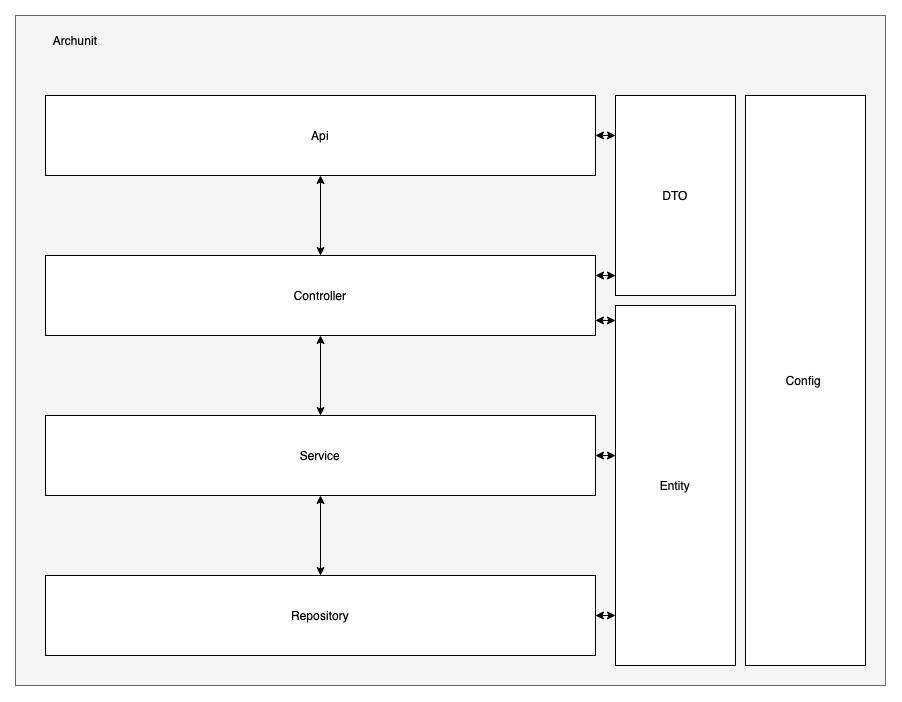

# Archunit example application
## Overview
This Spring Boot application was created just to deal with the Archunit framework. 
For that I created a four layer architecture (see figure overview-v1):
- Api
- Controller
- Service
- Repository

The call hierarchy should be: API -> Controller -> Service -> Repository
The goal is to check this behaviour with archunit!

## API - Layer
Will be responsible for the following things:
- Request mapping
- Request- & Response- & Error- handling
- Handling of the status codes
- Simple parameter validation with Hibernate validator 

## Controller - Layer
Will be responsible for the following things:
- DTO -> Entity
- Entity -> DTO
- Complex mapping (e.g.: Loading references)
- Permission checks with @PreAuthorize
- Business validation 
- Start the transaction if needed

## Service - Layer
Precondition: It only accept valid objects!
Will be responsible for the following things:
- here is the place where the magic happens

## Repository - Layer
Precondition: It only accept valid objects!
Will be responsible for the following things:
- persist and read the data